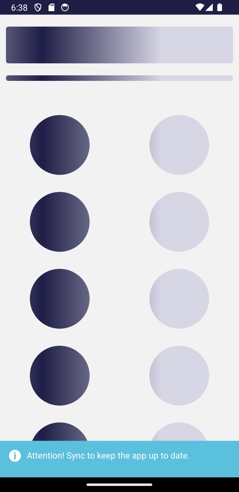
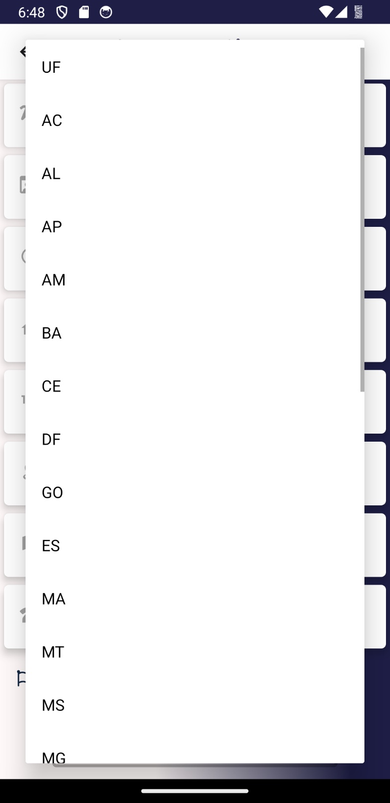

# DualPDV
Repositório para o DualPDV, aplicativo mobile desenvolvido com React Native, voltado para atuação como ponto de venda, fluxo de caixa e recebimento de contas (PDV). O app é responsivo, multilíngue e preparado para gerar relatórios em PDF, além de possuir integração com impressoras térmicas bluetooth.
# 🧾 DualPDV (fluxPOS)

**DualPDV** é um aplicativo móvel desenvolvido com **React Native**, voltado para operações de **ponto de venda (PDV)** em ambientes comerciais e agroindustriais. Totalmente responsivo, multilíngue (🇧🇷 Português e 🇺🇸 Inglês) e com suporte a impressão térmica via Bluetooth, o app também permite a geração de relatórios em PDF de forma prática.

## ✨ Funcionalidades principais

- 📦 **PDV Móvel** com interface limpa e intuitiva
- 🌐 **Suporte a dois idiomas**: Português e Inglês
- 📱 **Interface responsiva** com `react-native-responsive-fontsize`
- 🎨 **Temas claros e escuros com React Native Paper**
- 🖨️ **Integração com impressoras térmicas** via `react-native-bluetooth-escpos-printer`
- 🧾 **Geração de PDF** com `react-native-html-to-pdf`
- 📆 Seletores de data, máscaras e validações customizadas
- 🔃 Gerenciamento de estado com `Redux` e `Realm`
- 🔤 Fonts e ícones personalizados (Vector Icons, MDI)
- ⚙️ Estrutura Android já configurada para build nativo

# Instale as dependências
yarn install

# Rode no Android
yarn android

# (opcional) Link manual de bibliotecas nativas
npx react-native link

## Screenshots

